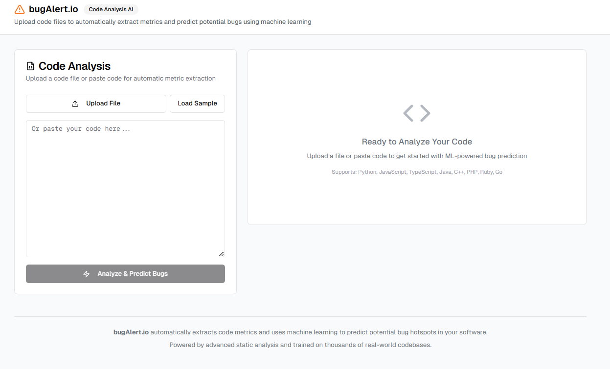
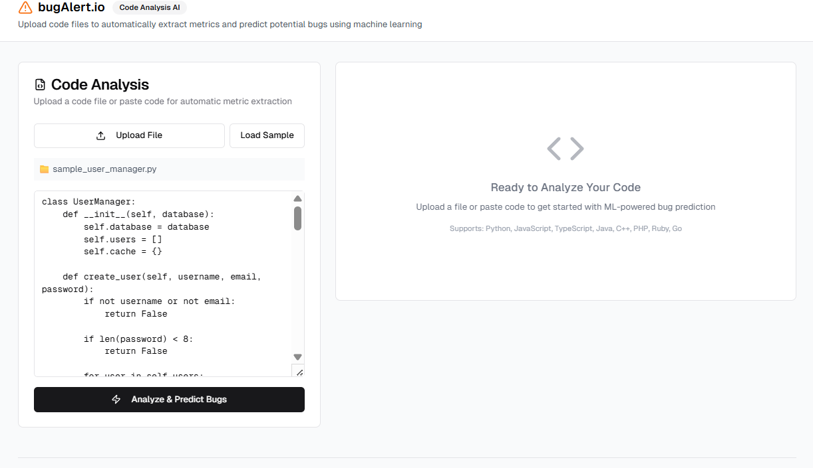
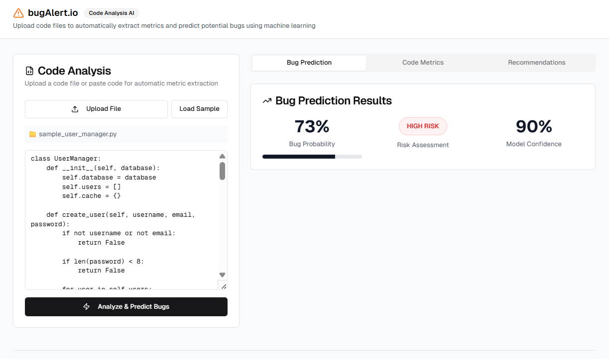
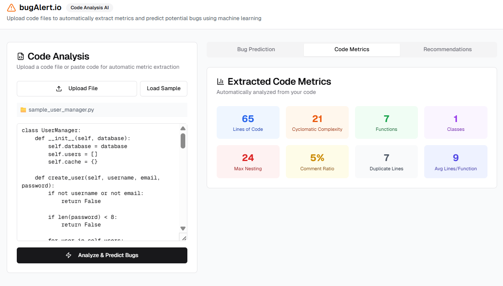
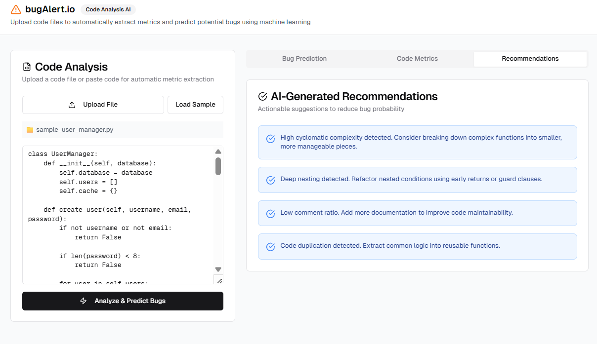

# 🛡️ bugAlert.io – AI-Powered Code Bug Prediction Platform

**bugAlert.io** is a machine learning–powered code analysis platform that automatically analyzes uploaded code files, extracts software metrics, and predicts potential bugs before deployment. It uses static analysis in conjunction with trained machine learning models to detect risk factors, offering actionable recommendations to improve software reliability and maintainability.

<p align="center">
  
</p>

---

## 🔍 Overview

Modern software systems often suffer from hidden bugs and poor code maintainability due to deep complexity, inadequate documentation, and duplication. **bugAlert.io** is designed to proactively analyze such codebases and:

- Predict **bug probabilities** with high model confidence.
- Evaluate **software complexity** metrics (like cyclomatic complexity, nesting depth, etc.).
- Offer **AI-generated refactoring recommendations**.
- Support multiple programming languages including Python, JavaScript, TypeScript, Java, C++, PHP, Ruby, and Go.

> 🧠 Trained on **NASA’s MDP Dataset** (from Kaggle) – a historic dataset of real-world bug annotations used in software reliability research.

---

## 🚀 Features

| Feature | Description |
|--------|-------------|
| 🔬 **Static Code Analysis** | Analyze source code statically without execution. |
| 📊 **Code Metrics Extraction** | Extract 9+ metrics including LOC, cyclomatic complexity, comment ratio, etc. |
| 🤖 **Bug Prediction Engine** | Predicts bug probability using a machine learning classifier trained on NASA’s defect dataset. |
| 🧠 **ML Model Confidence** | Shows how confident the model is in its predictions. |
| 📈 **Risk Assessment** | Flags "HIGH RISK" code segments needing immediate attention. |
| 🛠️ **Actionable Recommendations** | Suggests code refactorings such as early returns, reduced nesting, and modularization. |
| 🧳 **Containerized Deployment** | Fully containerized for scalable deployment using Docker. |
| ☁️ **Frontend-Backend Architecture** | Cleanly separated UI and logic for maintainability and scalability. |

---

## 📂 Sample Workflow

### 1. Upload Code
Upload a Python or JavaScript file directly or paste it in the code editor.

<p align="center">
  
</p>

---

### 2. Get Bug Predictions

Analyze code for bug probabilities and confidence scores.

<p align="center">
  
</p>

---

### 3. Explore Code Metrics

Dive into metrics such as cyclomatic complexity, nesting depth, function count, and more.

<p align="center">
  
</p>

---

### 4. Get AI Recommendations

Understand how to reduce bug probability using clear, ML-generated improvement suggestions.

<p align="center">
  
</p>

---

## 🏗️ Tech Stack

| Layer | Tools Used |
|-------|------------|
| **Frontend** | HTML, Tailwind CSS, JavaScript |
| **Backend** | Python, FastAPI |
| **ML Engine** | Scikit-learn, pandas, custom feature extractors |
| **Training Dataset** | [NASA MDP Dataset (Kaggle)](https://www.kaggle.com/datasets/ishadss/nasa-software-defect-predictor) |
| **Containerization** | Docker, Docker Compose |
| **CI/CD (Planned)** | GitHub Actions, Docker Hub |

---

## 🧠 Machine Learning Details

- **Model Type**: Random Forest Classifier
- **Trained On**: NASA MDP datasets (CM1, KC1, PC1, etc.)
- **Features Used**:
  - LOC, McCabe Cyclomatic Complexity, Max Nesting
  - Comment Density
  - Number of Functions/Classes
  - Duplicated Line Detection
- **Prediction**: Outputs bug probability + confidence score

---

## 📦 Setup & Run Locally (Containerized)

```bash
# Clone the repository
git clone https://github.com/yourusername/bugAlert.io.git
cd bugAlert.io

# Build the Docker image
docker build -t bugalert-app .

# Run the container
docker run -p 8080:8080 bugalert-app
